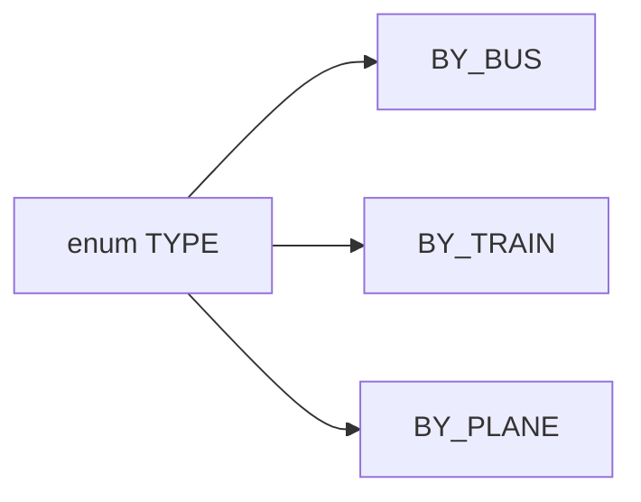
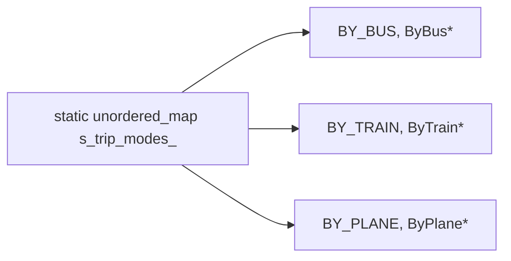
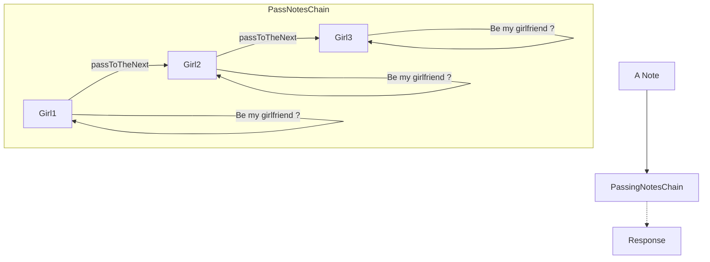
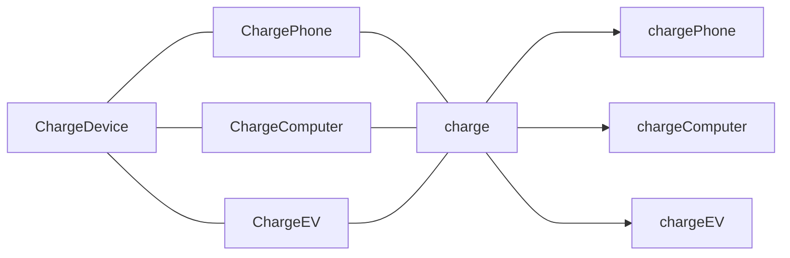

## Strategy


### Case 1: TripMode







### Case 2: MathOperation


### Case 3: ParseFile


## Chain of Responsibility


```cpp
void filter(const Request& req, Response& res) {
	deal(req, res);
#ifdef Stop passing down
    if(res == FINISHED) 
        return;
#endif
	auto next_handle = getNextHandle();
    if(next_handle)
        next_handle->filter(req, res);
#endif
}
```


### Case 1: Logger


### Case 2: PassNotes


## Template


### Case 1: Charge Device




### Case 2: Play Game


## State


### LightSwitch


