# Behavioral Patterns

## Strategy

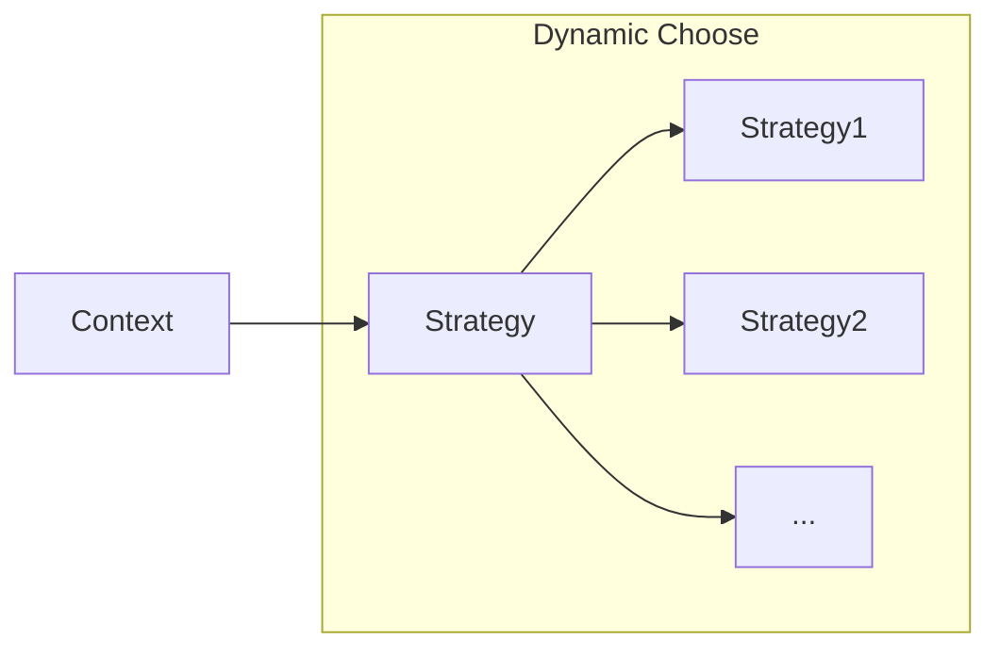

### Case 1: TripMode

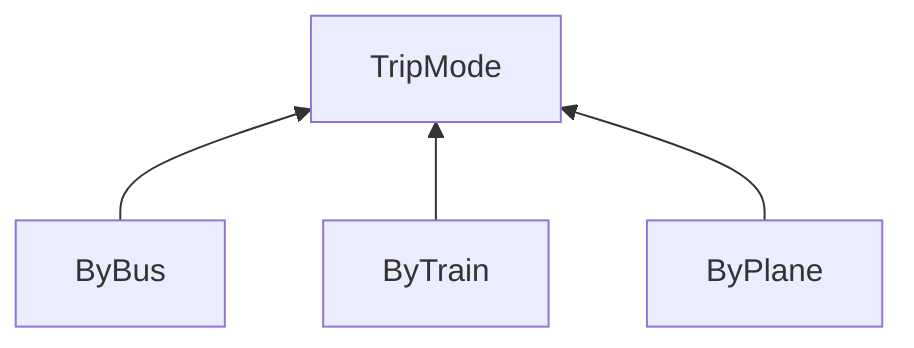

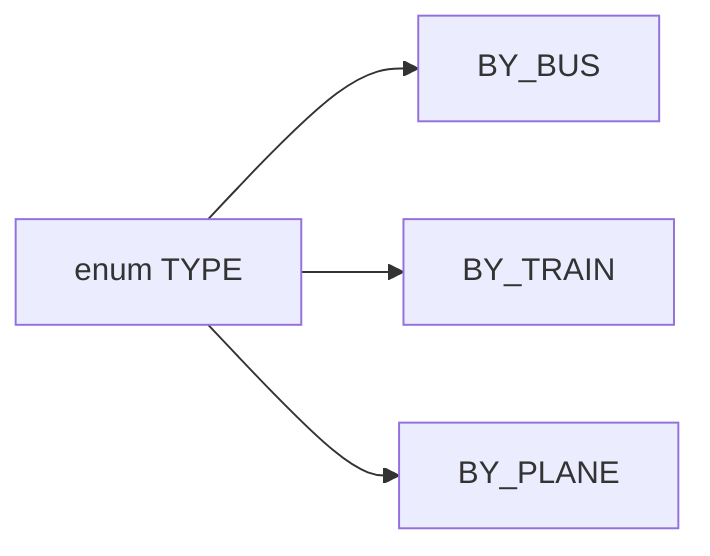

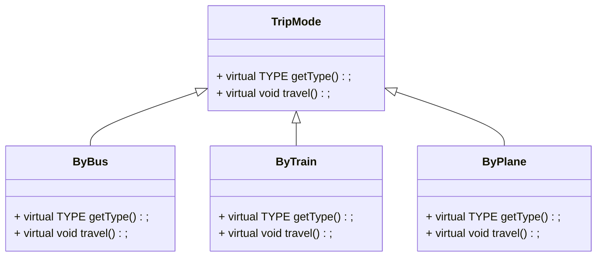

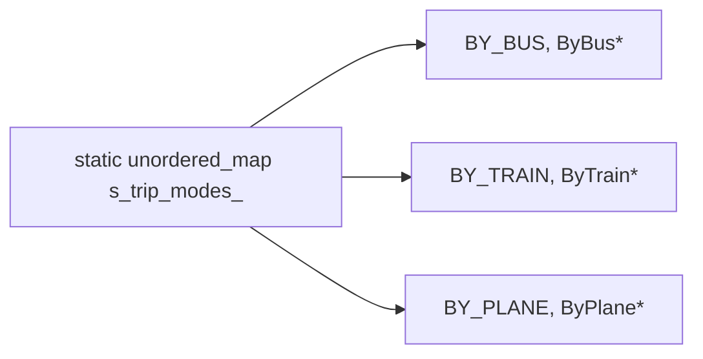

### Case 2: MathOperation

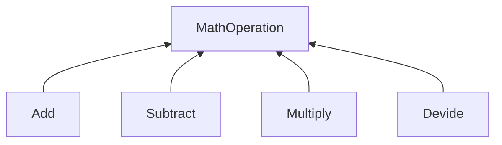

### Case 3: ParseFile

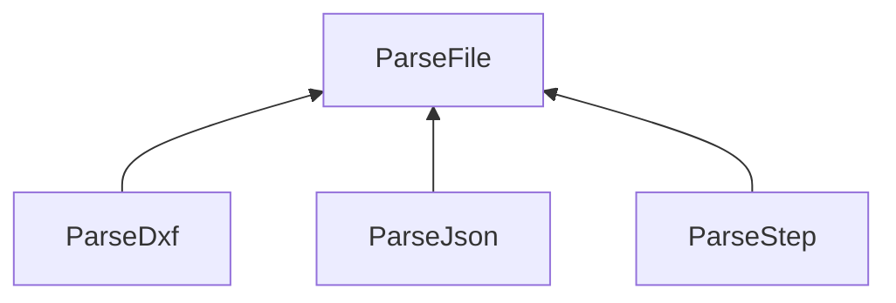

## Chain of Responsibility

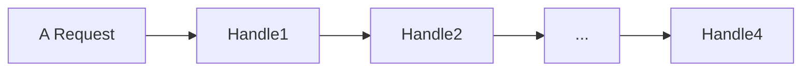

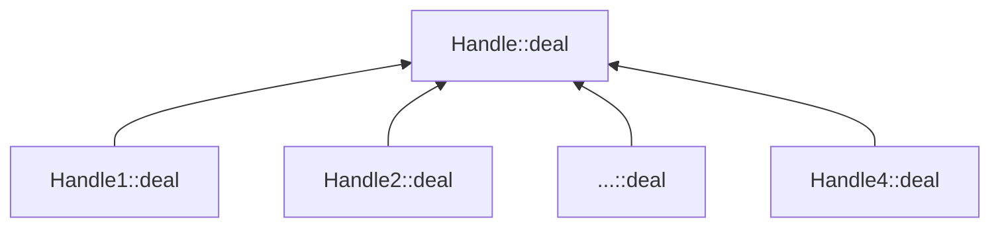

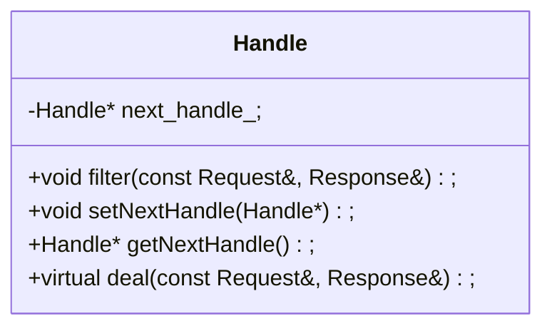

```cpp
void filter(const Request& req, Response& res) {
 deal(req, res);
#ifdef Stop passing down
    if(res == FINISHED)
        return;
#endif
 auto next_handle = getNextHandle();
    if(next_handle)
        next_handle->filter(req, res);
#endif
}
```

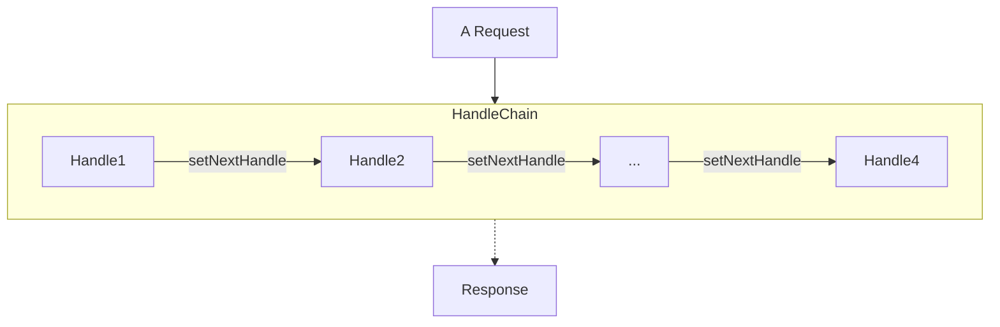

### Case 1: Logger

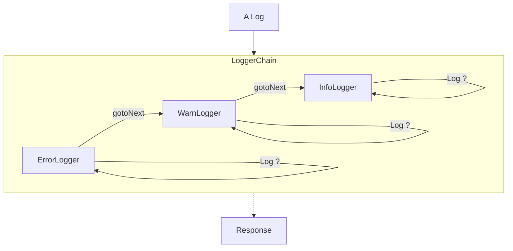

### Case 2: PassNotes

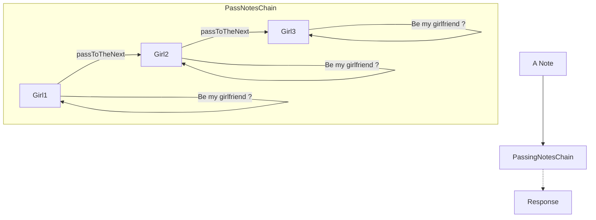

## Template

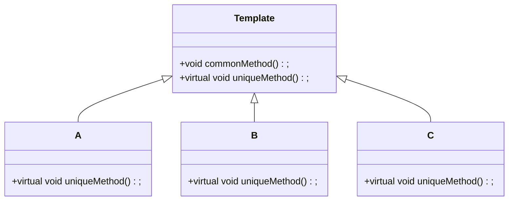

### Case 1: Charge Device

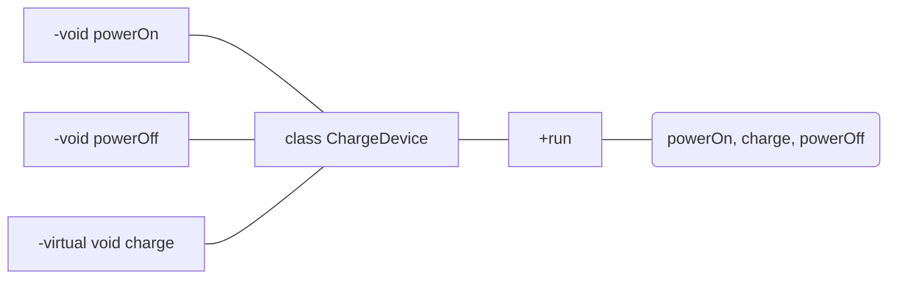

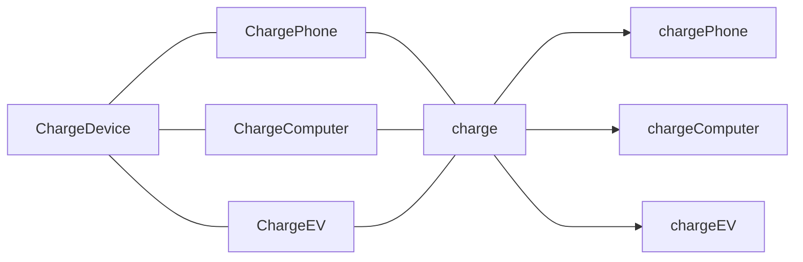

### Case 2: Play Game

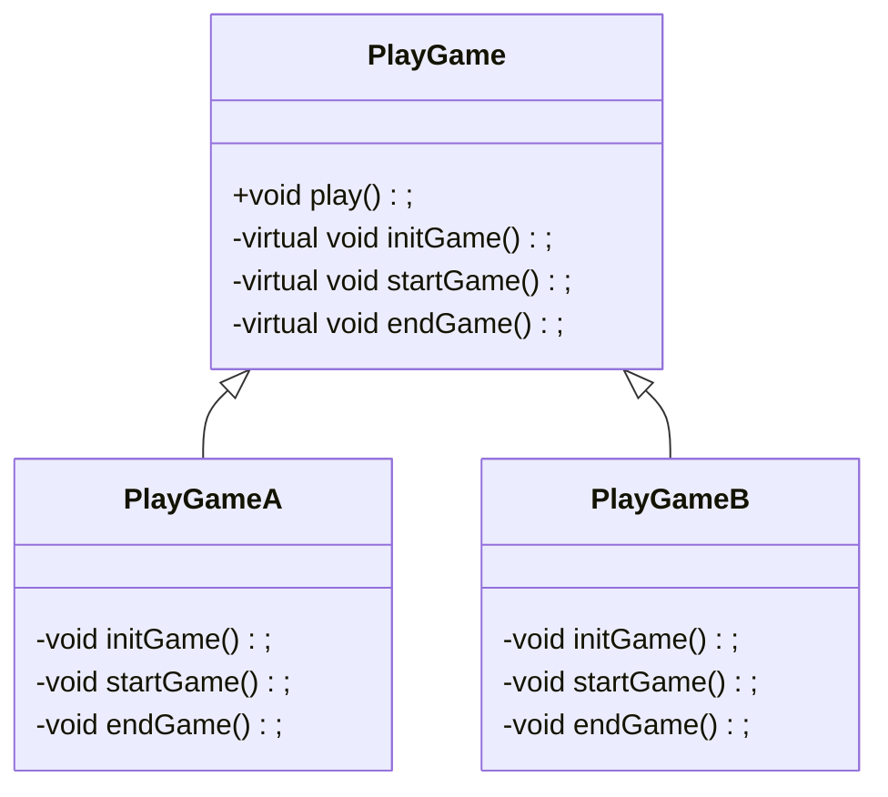

## State

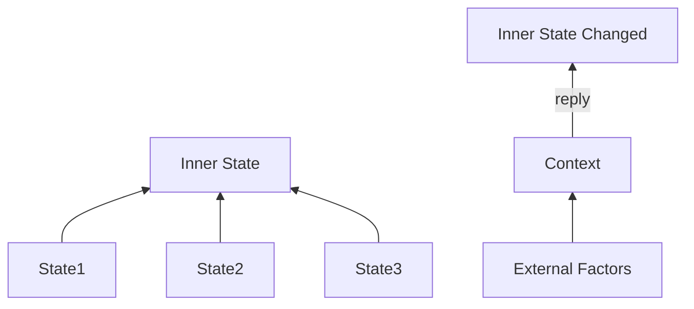

### LightSwitch

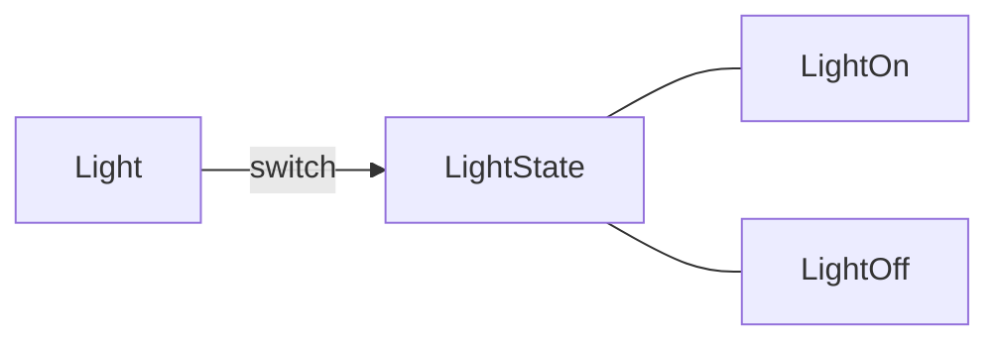
