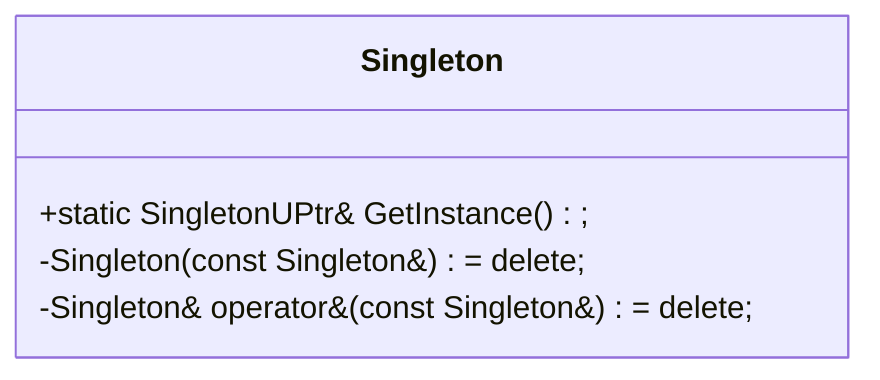
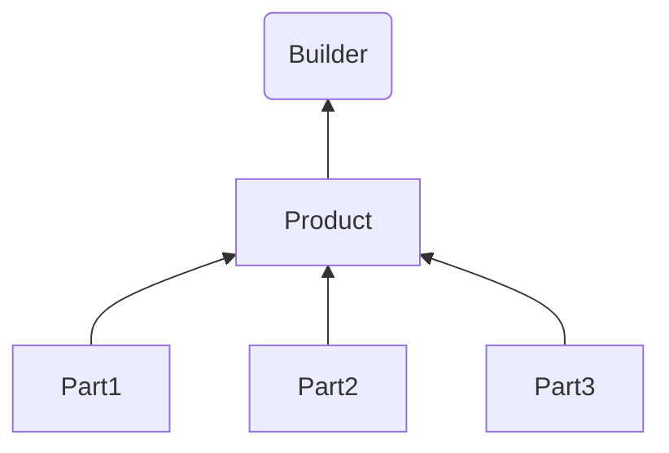
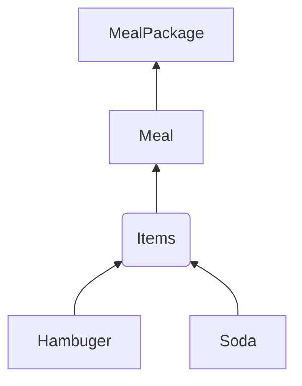
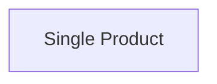
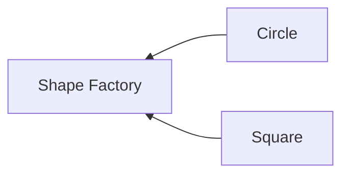
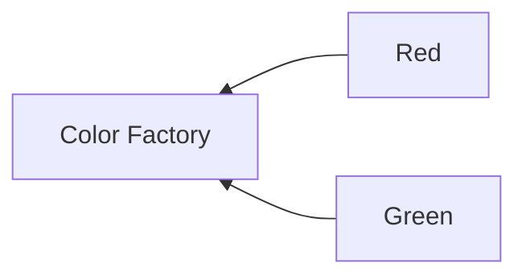
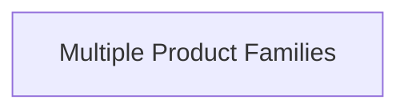
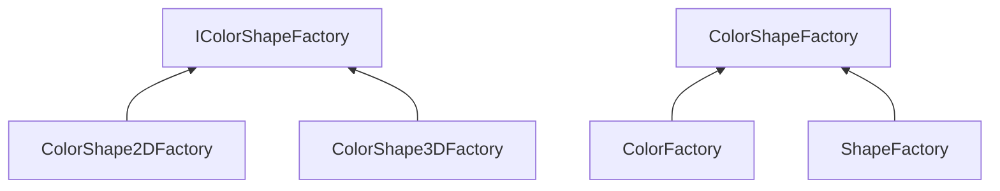

# Creational Patterns

## Singleton

## Builder

### Case1: Meal Package

## Factory

### Case1: Shape Factory

### Case2: Color Factory

## Abstract Factory

### Case1: Color Shape Factory

## Prototype
