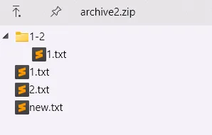

# Examples

## a-Add

1. 添加目录, 包含`subdir\`前缀

    `7z a archive1.zip subdir\` or `7z a archive1.zip subdir\*`

    ```plain
    subdir/
    ├── 1-2/
    │   └── 1.txt
    ├── 1.txt
    └── 2.txt
    ```

    

2. 添加目录, 不包含`subdir\`前缀

    `7z a archive2.zip .\subdir\*`

    ```plain
    subdir/
    ├── 1-2/
    │   └── 1.txt
    ├── 1.txt
    └── 2.txt
    ```

    

3. 添加文件

    `7z a subdir.7z new.txt`

    
    

## x-Extract

1. 解压到当前目录

    `7z x archive2.zip`

    

    ```plain
    folder/
    └── archive2.zip
    ```

    ```plain
    ├── 1-2/
    │   └── 1.txt
    ├── 1.txt
    ├── 2.txt
    ├── new.txt
    └── archive2.zip
    ```

2. 解压到指定目录下

    `7z x archive2.zip -oarchive2`

    

    ```plain
    folder/
    └── archive2.zip
    ```

    ```plain
    folder/
    ├── archive2/
    │   ├── 1-2/
    │   │   └── 1.txt
    │   ├── 1.txt
    │   ├── 2.txt
    │   └── new.txt
    └── archive2.zip
    ```
