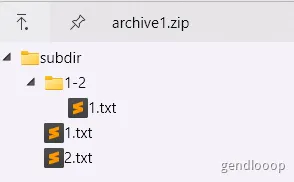
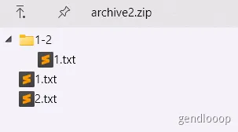
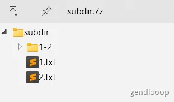
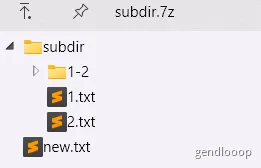

# Guide

## a-Add

1. 添加目录, 包含`subdir\`前缀
    `7z a archive1.zip subdir\`
    or `7z a archive1.zip subdir\*`

    ```plain
    subdir/
    ├── 1-2/
    │   └── 1.txt
    ├── 1.txt
    └── 2.txt
    ```

    

2. 添加目录, 不包含`subdir\`前缀
    `7z a archive2.zip .\subdir\*`

    ```plain
    subdir/
    ├── 1-2/
    │   └── 1.txt
    ├── 1.txt
    └── 2.txt
    ```

    

3. 添加文件
    `7z a subdir.7z new.txt`
     

## e-Extract
