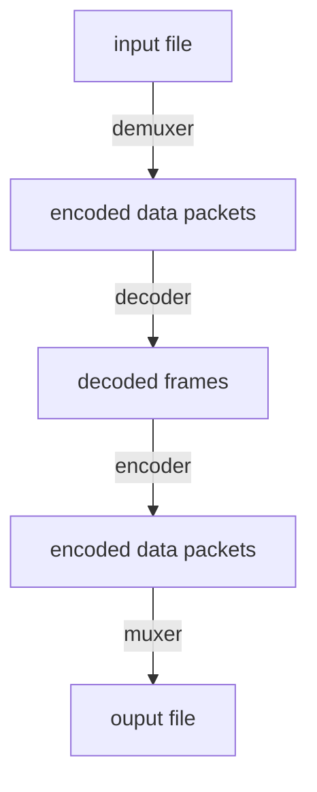
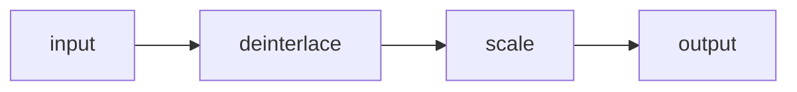
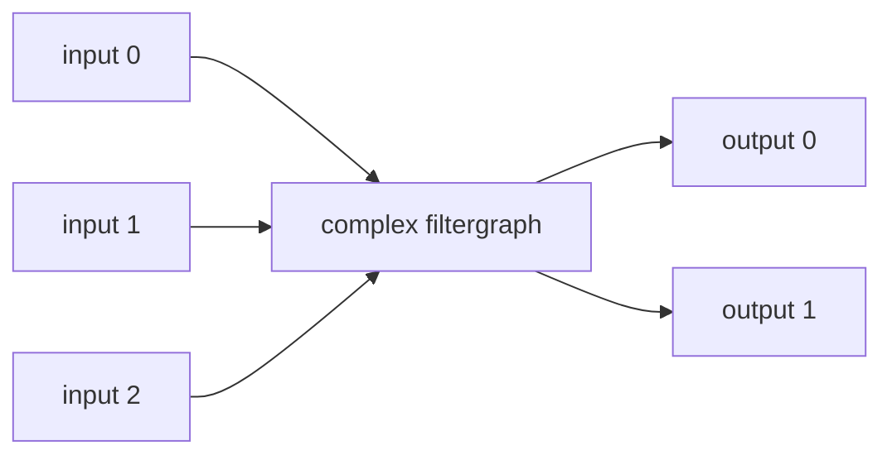
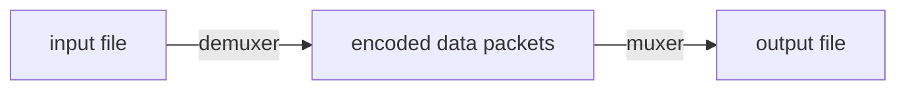

# Guide

## Synopsis

```bash
ffmpeg [global_options]
      {[input_file_options] -i input_url} ...
      {[output_file_options] output_url} ...
```

## Description

### Some simple examples

1. Convert an input media file to different format, by re-encoding media streams

    `ffmpeg -i input.avi output.mp4`

2. Set the vidio bitrate to 64 kb/s and a buffer size of 64 kb

    `ffmpeg -i input.avi -b:v 64k -bufsize 64k output.mp4`

3. Force the frame rate of the output file to 24 fps

    `ffmpeg -i input.avi -r 24 output.mp4`

4. Force the frame rate of the input file (valid for raw formats only) to 1 fps and the frame rate of the ouput file to 24 fps

    `ffmpeg -r 1 -i input.avi -r 24 output.mp4`

## Detailed description

Transcoding process



### Filtering

Before encoding, `ffmpg` can process raw audio and video frames using filters from the libavfilter library.

#### Simple filtergraphs

Simple filtergraphs are those that have excatly one input and output, both of the same type.


A simple filtergraph for video can look for example like this



Some filters change frame properties but not frame contents. E.g.

* the `fps` filter in the example above changes number of frames, but doesn't touch the frame contents
* the `setpts` filter, which only sets timestamps and otherwise passes the frames unchanged

#### Complex filtergraphs

Complexx filtergraphs are those which cannot be described as simply a linear processing chain applied to one stream. E.g.

* more than one input and/or output
* when output stream type is different from input



### Steam copy

Steam copy is a mode selected by supplying the `copy` parameter to the -codec option.

It only demuxing and muxing, so it is very fast and there is no quality loss.



## Stream selection

* `-map`option for manual control of stream selection in each output file

    `ffmpeg -i input.mp4 -map 0:v:0 -map 0:a:0 ouput.mp4`

* `-vn` skip video streams

    `ffmpeg -i input.mp4 -vn output.mp4`

* `-an` skip audio streams

    `ffmpeg -i input.mp4 -an output.mp4`

* `-sn` skip subtitle streams

    `ffmpeg -i input.mp4 -sn output.mp4`

* `-dn` skip data streams

    `ffmpeg -i input.mp4 -dn output.mp4`


### Description

The sub-sections that follow describe the various rules that are involved in stream selection

#### Automatic stream selection

* for video, it is the stream with the highest resolution
* for audio, it is the stream with the most channels
* for subtitles, it is the first subtitle stream found but there's a caveat. The output format's default subtitle encoder can be either text-based or image-based, and only a subtitle stream of the same type will be chosen
* the stream with the lowest index is selected in advance
* data or attachment streams are not automatically selected and can only be included using `-map`

#### Manual steam selection

When `-map` is used, only user-mapped stream are included in that ouput file.

#### Complex filtergraphs

If there are any complex filtergraph output streams with unlabeled pads, they will be added to the first ouput file.

#### Stream handing

Steam handing is independent of stream selection.

Stream handing is set via the `-codec` option addressed to streams within a specific output file

### Examples

The following examples illustreatethe behavior, quirks and limitations of ffmpeg's stream selection methods

Assume the following three input files

```plain
input file 'A.avi'
 stream 0: video 640x360
 stream 1: audio 2channels

input file 'B.mp4'
 stream 0: video 1920x1080
 stream 1: audio 2 channels
 stream 2: subtitles (text)
 stream 3: audio 5.1 channels
 stream 4: subtitles (text)

input file 'C.mkv'
 stream 0: video 1280x720
 stream 1: audio 2 channels
 stream 2: subtitles (image)
```

> .avi, .mkv, .mov, .mp4: support video, audio
> .wav: only support audio

#### Example: automatic stream selection

`ffmpeg -i A.avi -i B.mp4 out1.mkv out2.wav -map 1:a -c:a copy out3.mov`

* `out1.mkv`
  * video: select `stream0` from `B.mp4`, whic has the hightest resolution
  * audio: select `stream3` from `B.mp4`, since it has the greatest number of channels
  * subtitles: select `stream2` from `B.mp4`, which is the first subtitle stream
* `out2.wav`
  * audio: select `stream3` from `B.mp4`
* `out3.mov`
  * `-map 1:a`: select all audio streams from the second input `B.mp4`
  * `-c:a copy`: copy audio streams, so no decoding-filtering-encoding operations

#### Example: automatic subtitles selection

`ffmpeg -i C.mkv out1.mkv -c:s dvdsub -an out2.mkv`

* `out1.mkv`
  * the subtitle stream of C.mkv is image-based and the default subtilte encoder of the Matroska muxer is text-based, so subtitles stream will not be selected
  * only a video and audio stream shall be selected
* `out2.mkv`
  * a subtitle encoder is specified and so the subtitle stream is selected
  * in addtion to the video stream

#### Example: unlabeled filtergraph outputs

`ffmpeg -i A.avi -i C.mkv -i B.mp4 -filter_complex "overlay" out1.mp4 out2.srt`

* `out1.mp4`
  * `-filter_complex "overlay"`: requires exactly two video inputs, but none are specified, so the first two video streams are used, those of `A.avi` adn `C.mkv`, automatic selection of the video stream is skipped
  * the audio stream shall automatically chose `stream3` in `B.mp4`
  * no subtitle stream is chosen
* `out2.srt`
  * only accept `text-based` subtitle streams. So skip the image-based subtitle stream in C.mkv and choose `stream 2` in `B.mp4`

#### Example: labeled filtergraph outputs

todo

## Options

todo

### Stream specifiers

todo

### Generic options

todo

### AVOptions

todo

### Main options

#### `-f` format(input/output)

Force input or output file format.

The format is normally auto detected for input files and guessed from the file extension for output files, so this option is not needed in most cases

e.g. `ffmpeg -i input.avi -f mp4 output.mp4`

#### `-i` url(input)

Input file url

## References

1. [https://ffmpeg.org/ffmpeg.html](https://ffmpeg.org/ffmpeg.html)
