## Overview

> 测试环境: Typora

* Mermaid可以通过解析类Markdown的文本语法来实现图表的创建和动态修改。
* 支持的图表类型
  * 流程图  `graph` or `flowchart`
  * 时序图  `sequenceDiagram`
  * 甘特图  `gantt`
  * 类图  `classDiagram`
  * 状态图 `stateDiagram`
  * 饼图  `pie`
  * 旅程图 `journey`

## 图表实例

### 流程图

#### 方向

```markdown
%% 我是注释, 不会显示
graph TB
上 --> 下
graph BT
下 --> 上
graph LR
左 --> 右
graph RL
右 --> 左
```


#### 形状

```markdown
graph TB
  默认方形 ---
  id1[方形] ---
  id2(圆边矩形) ---
  id3([体育场形]) ---
  id4[[子程序形]] ---
  id5[(圆柱形)] ---
  id6((圆形)) ---
  id7{菱形} ---
  id8{{六角形}} ---
  id9[/平行四边形/] ---
  id10[\反向平行四边形\] ---
  id11[/梯形\] ---
  id12[\反向梯形/]
```


#### 箭头

```markdown
graph LR
S1[实线] --> E1[实线] --Msg--> E12[实线]
S2[粗实线] ==> E2[粗实线] ==Msg==> E21[粗实线]
S3[虚线] -.-> E3[虚线] -.Msg.-> E31[虚线]
S4[实线] --- E4[粗实线] === E41[虚线] -.- E42[ ]
```


#### 多重链

```markdown
graph LR
A --> B & C --> D
F & G --> H & I
```


#### 子图

将`graph`改为`flowchart`

```markdown
flowchart
A --> B
subgraph First
A1 --> B1
end
subgraph Second
A2 --> B2
end
```


#### 描边

```markdown
flowchart LR
A:::red & B:::green --> C:::blue
classDef red stroke:#f00
classDef green stroke:#0f0
classDef blue stroke:#00f
```


#### 实例

```markdown
graph LR
1-1 --> 2-1
1-2 --> |Text| 2-2
1-3 -.Text.-> 2-3
1-4(1-4) --> 2-4(2-4)
1-5((1-5)) --> 2-5((2-5))
1-6{1-6} -..-> 2-6{2-6}
```


### 时序图

#### 实例

```markdown
sequenceDiagram
A ->> B: Hello, B, have you finished ?
loop Check
 B ->> B: Have I finished ?
end
Note right of B: Rational thougths
B -->> A: Of course I did.
B ->> A: How about you ?
A -->> B: Me too.
```

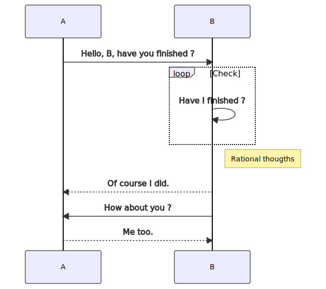

### 甘特图

#### 实例

```markdown
gantt
title 计划
dateFormat YYYY-MM-DD
section Section1
Completed  :done, des1, 2023-04-01, 2023-04-03
Active   :active, des2, 2023-04-02, 1d
Parallel 1 :des3, after des1, 1d
Parallel 2 :des4, after des1, 1d
Parallel 3 :des5, after des3, 1d
Parallel 4 :des6, after des4, 1d
```


### 类图

#### 实例

```markdown
classDiagram
Base <|-- Derived1
Base <|-- Derived2: With Meg
Base -- Derived3
Base <-- Derived4
Base *-- Derived5

class Base {
 <<Interface>>
 +int public_var_
 -int private_var_
 +void getPublicMethod()
 -void getPrivateMethod()
}

class Derived1 {
 <<Inherited>>
 -dobule private_d1_var_
 +void setPrivateD1Var()
}

class Derived2 {
 <<Inherited>>
 -dobule private_d2_var_
 +void setPrivateD2Var()
}
```


### 状态图

#### 实例

```markdown
stateDiagram
[*] --> 登陆状态
登陆状态 --> 登陆失败
登陆失败 --> [*]
登陆状态 --> 登陆成功
登陆成功 --> 进入系统
进入系统 --> 浏览信息
浏览信息 --> 退出系统
退出系统 --> [*]
```


### 饼图

#### 实例

```markdown
pie
title Fruit
"Apple" : 40
"Orange": 30.55
"Banana": 30
"Peach" : 20
"Pear" : 10
```

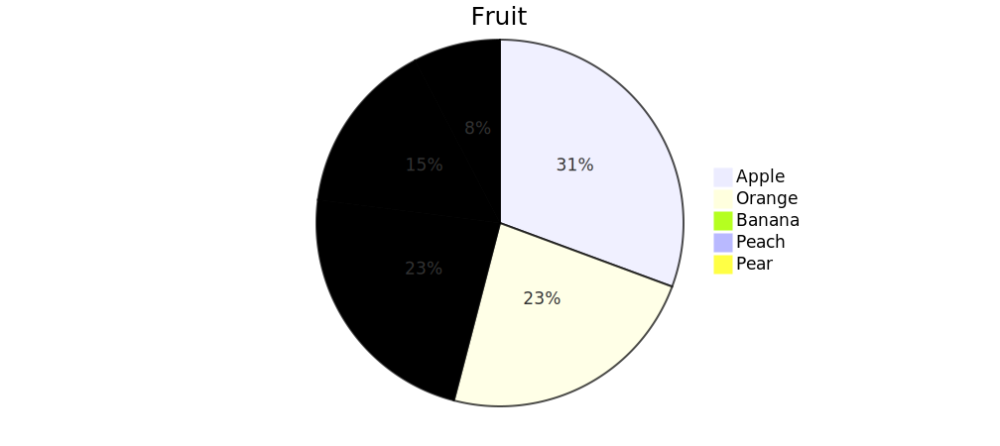

### 用户心情旅程图

```markdown
journey
title My Working Day
section Go to work
  Get up:    5: Me
  Go upstairs:  3: Me
  Do Work:    1: Me, Dog
section Go home
  Sit up:    1: Me
  Go off Work:  3: Me
  Get home:   5: Me
```


## References

1. [Flowcharts Syntax | Mermaid](https://mermaid.js.org/syntax/flowchart.html)
2. [Mermaid从入门到入土.md](https://www.yuque.com/attachments/yuque/0/2023/md/22048361/1681431672255-2ee00dda-7003-4d3e-a02b-e7fb4fe1f3a0.md)
3. [使用Typora画图.htm](https://www.yuque.com/attachments/yuque/0/2023/html/22048361/1681431679848-943f2625-95de-46df-99ae-d885bc270cff.html)
4. [mermaid/README.zh-CN.md at develop · mermaid-js/mermaid](https://github.com/mermaid-js/mermaid/blob/develop/README.zh-CN.md)
5. [mermaid/README.md at develop · mermaid-js/mermaid](https://github.com/mermaid-js/mermaid/blob/develop/README.md)
