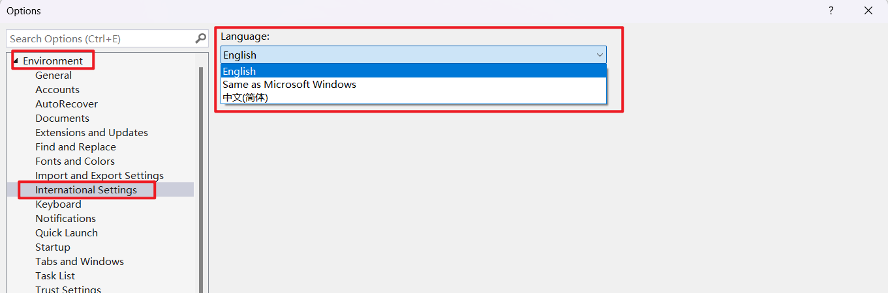
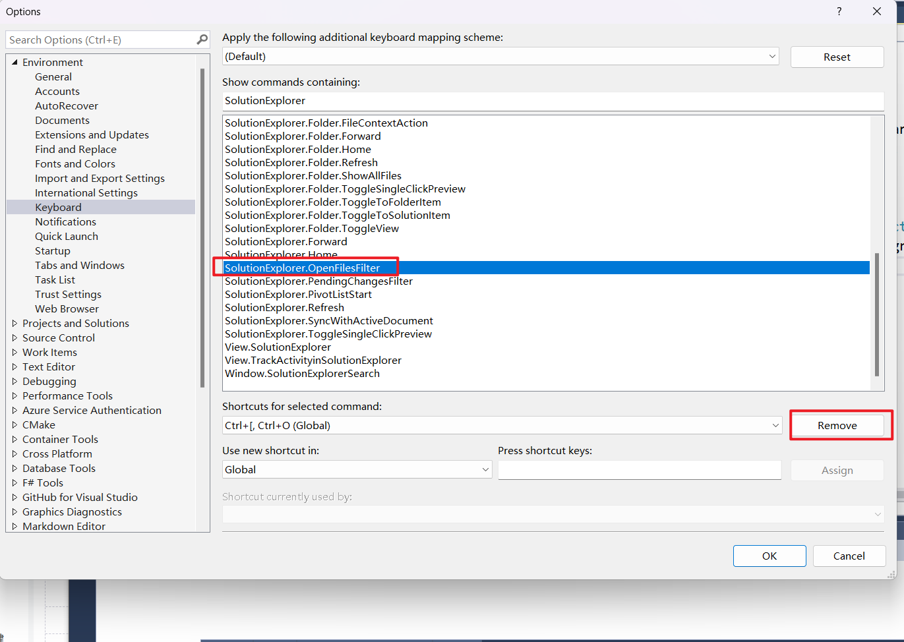
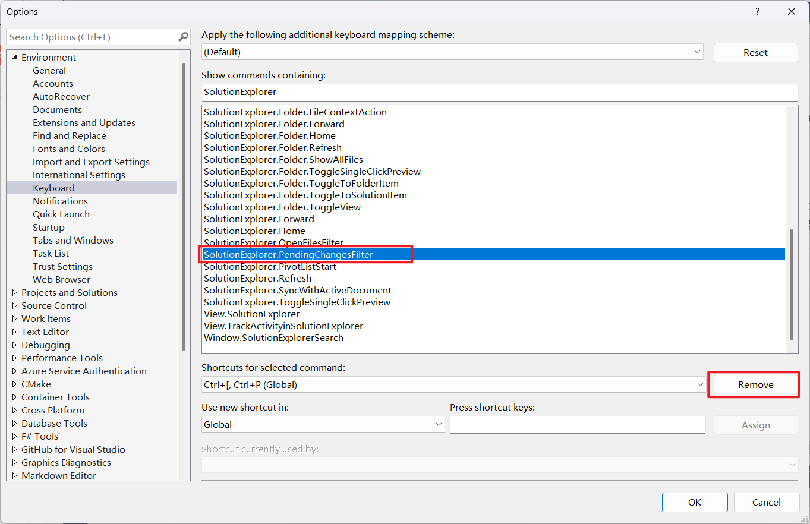
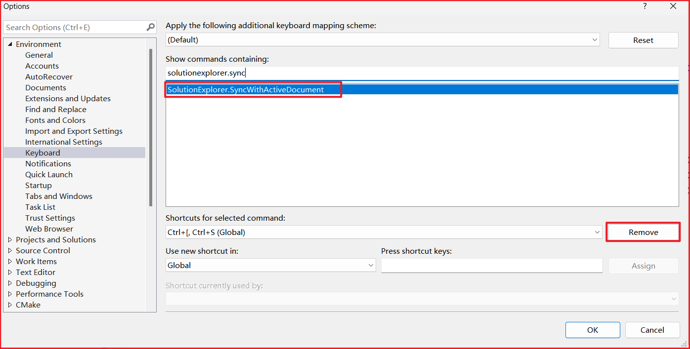

# Summary

## VSVim

### Fail to use `Ctrl+[`

1. Set Visual Studio language to English:

    Tools => Options => Environment => International Settings => English

    

2. Restart VS
3. Delete the keyboard mapping related to `Ctrl + [`
    * Enter Page Tools => Options => Environment => Keyboard
    * Delete `SolutionExplorer.OpenFilesFilter`

      

    * Delete `SolutionExplorer.PendingChangesFilter`

      

    * Delete `SolutionExplorer.SyncWithActiveDocument`

      

4. Set the language of VS to the default language, restart VS.

### 键位设置

除以下键位采用VisualStudio外, 其他均采用VsVim

* `Ctrl+S`
* `Ctrl+K`
* `Ctrl+O`

## VSCodeVim

### Chinese input repeats character in insert mode

Set `editor.experimentalEditContextEnabled` to false.

```git
{
 "editor.experimentalEditContextEnabled": false
}
```

## vim-plug

vim 插件管理器

1. 安装 vim-plug

    **Linux**

    ```bash
    curl -fLo ~/.vim/autoload/plug.vim --create-dirs \
        https://raw.githubusercontent.com/junegunn/vim-plug/master/plug.vim
    ```

    **Windows**

    ```powershell
    iwr -useb https://raw.githubusercontent.com/junegunn/vim-plug/master/plug.vim |`
        ni $HOME/.vim/autoload/plug.vim -Force
    ```

2. 在`~/.vimrc`中添加下列信息并执行`:w`保存

    ```bash
    call plug#begin()

    " List your plugins here
    Plug 'tpope/vim-sensible'

    call plug#end()
    ```

3. 执行`:source ~/.vimrc`或直接重启vim
4. 按2.中示例添加新插件, 执行以下命令即可完成
    * `:PlugInstall` 安装插件(安装在`~/.vim/plugged`)
    * `:PlugUpdate` 更新插件
    * `:PlugClean!` 去掉不在List中的插件

## plugin

> 一般不需要安装任何插件, 个人建议可不使用插件功能

| **插件** | **说明** | **安装方式(使用vim-plug)** |
| :--- | :--- | :--- |
| [vim-airline](https://github.com/vim-airline/vim-airline) | 状态栏美化 | `Plug 'vim-airline/vim-airline'` |
| [vim-sensible](https://github.com/tpope/vim-sensible) | 一些较通用的默认配置 | `Plug 'tpope/vim-sensible'` |
| [godlygeek/tabular](https://github.com/godlygeek/tabular) | 代码对齐 | `Plug 'godlygeek/tabular'` |

## .vimrc

`$ vim ~/.vimrc`

```bash
call plug#begin()

" List your plugins here
Plug 'vim-airline/vim-airline'
Plug 'tpope/vim-sensible'
Plug 'godlygeek/tabular'

call plug#end()

" Indent
set shiftwidth=4
set tabstop=4
set expandtab
set softtabstop=4

" Backup
set nobackup
set nowb
set noswapfile

" Number
set nu
```
